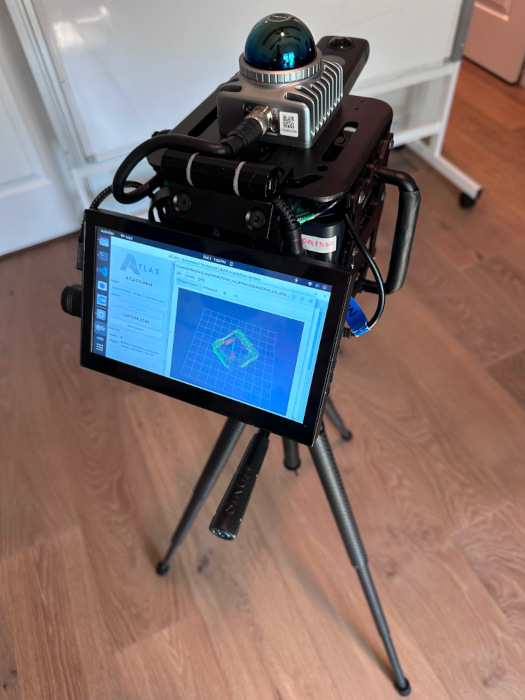

# Automated Terrestrial LiDAR Acquisition System (ATLAS)
*A low cost, open source hardware and software system for capturing physical environments using sensor fusion and a variety of 3D capture methods including terrestrial and SLAM.*

## Motivation
- In order to fully unlock the possibilities of 3D, a method for creating 3D content from physical spaces is needed to both test new capabilities and ingest as a new digital twin asset. Unfortunately for current 3D scanning systems, there is both a steep learning curve and a steep price (most scanners range from $1k-30k depending on hardware specifications and software licensing).

- This repository aims to provide a low-cost solution (~$1100 for new sensor setup) for building, deploying, and operating a 3D scanner (built from commercial-off-the-shelf components) for scanning physical environments and outputting dense colored point clouds. This solution includes both hardware and software components, as well as a setup guide to calibrate and test the system.
  > *Note: See `Hardware Bill of Materials` table below for component estimates at the time of writing this.*

## Technical Approach

### Hardware
- LiDAR w/ IMU
    - [Livox Mid360](https://www.livoxtech.com/mid-360)
        - 360° * 59° FoV
        - Non-repeating
        - 0.1m-40m range
        - Range Precision³ (1σ)
            - ≤ 2 cm (@ 10m)
            - ≤ 3 cm (@ 0.2m)
        - Angular Precision（1σ）
            - < 0.15º
        - ICM40609 IMU
- Spherical (360 degree) Camera
    - [Insta360 One X2](https://www.insta360.com/product/insta360-onex2)
        - 4K max resolution at 30fps
- Compute
    - 3.4GHz Quad Core, x64 architecture
    - 16GB DDR4 RAM
    - 512 GB SSD
    - Integrated Graphics Processor
- Accessories (optional)
    - See `Hardware Bill of Materials` for more information
- Complete scanner with accessories
    - 8" wide x 8" tall x 14" deep
    - 7lb

### OS
- Linux Ubuntu Jammy 22.04

### Software

#### TODO
- [ ] Release v1.0.0 code
- [x] Enable terrestrial mode
- [ ] Replace direct_visual_lidar_calibration feature matcher with [OpenCV 2D matcher](https://docs.opencv.org/4.x/db/dd9/group__xfeatures2d__match.html)
- [ ] Enable SLAM mode
- [ ] Implement scanning progress gui

#### Overview
- Base System
    - [ROS2 Humble](https://docs.ros.org/en/humble/Releases/Release-Humble-Hawksbill.html) - ([Apache 2.0/BSD-3-clause](https://docs.ros.org/en/diamondback/api/licenses.html))
- Drivers
    - [livox_ros_driver2](https://github.com/Livox-SDK/livox_ros_driver2) - ([MIT](https://github.com/Livox-SDK/livox_ros_driver2?tab=License-1-ov-file#readme))
    - [insta360_ros_driver](https://github.com/ai4ce/insta360_ros_driver) - ([Apache 2.0](https://github.com/ai4ce/insta360_ros_driver?tab=Apache-2.0-1-ov-file#readme))
    - [Insta360 SDK](https://www.insta360.com/developer/home)
- Tools
    - Calibration
        - [koide3/direct_visual_lidar_calibration](https://github.com/koide3/direct_visual_lidar_calibration) - ([MIT](https://github.com/koide3/direct_visual_lidar_calibration/blob/main/README.md))
    - Sensor Fusion
        - [CDonosoK/ros2_camera_lidar_fusion](https://github.com/CDonosoK/ros2_camera_lidar_fusion) - ([MIT](https://github.com/CDonosoK/ros2_camera_lidar_fusion?tab=MIT-1-ov-file#readme))
    - Global Mapping
        - [PRBonn/rko_lio](https://github.com/PRBonn/rko_lio) - ([MIT](https://github.com/PRBonn/rko_lio?tab=MIT-1-ov-file#readme))
    - Point Cloud Alignment/ICP
        - [Open3D](https://github.com/isl-org/Open3D) - ([MIT](https://github.com/isl-org/Open3D?tab=License-1-ov-file#readme))

#### ROS2 Details
- Published Topics
    - Lidar
        - /livox/lidar
            - ~10Hz
        - /livox/imu
            - ~200Hz
    - Camera
        - /dual_fisheye/image
            - ~0.2Hz
        - /dual_fisheye/image/compressed
            - ~30Hz
        - /equirectangular/image
            - ~0.4Hz
        - /imu/data
            - ~60Hz (not used)
        - /imu/data_raw
            - ~60Hz (not used)
    - Mapping
        - /rko_lio/odometry
            - ~10Hz
        - /rko_lio/odometry_buffered
            - ~10Hz
        - /tf
            - ~60Hz
- Transforms
    - odom → base_link → livox_frame
    - camera_to_lidar
        - Handled in image to lidar projection, uses extrinsic calibration obtained during calibration step
    - dual_fisheye_to_equirectangular_projection
        - Handled in camera driver, uses intrinsic calibration obtained during calibration step

#### Software Installation
> *Note: Only Linux Ubuntu Jammy 22.04 is currently supported*

```
# Install dependencies
sudo apt-get update
sudo apt-get install -y libgoogle-glog-dev libgflags-dev libatlas-base-dev libeigen3-dev libsuitesparse-dev software-properties-common lsb-release python3-sensor-msgs python3-opencv ros-humble-rosbag2-transport ffmpeg ros-humble-robot-localization ros-humble-topic-tools ros-humble-cartographer ros-humble-cartographer-ros ros-humble-slam-toolbox ros-humble-pointcloud-to-laserscan ros-humble-cv-bridge ros-humble-vision-opencv libopencv-* libomp-dev libboost-all-dev libglm-dev libglfw3-dev libpng-dev libjpeg-dev

# Install cmake
wget -O - https://apt.kitware.com/keys/kitware-archive-latest.asc 2>/dev/null | gpg --dearmor - | sudo tee /etc/apt/trusted.gpg.d/kitware.gpg >/dev/null
sudo apt-add-repository "deb https://apt.kitware.com/ubuntu/ $(lsb_release -cs) main"
sudo apt update
sudo apt install kitware-archive-keyring
sudo rm /etc/apt/trusted.gpg.d/kitware.gpg
sudo apt update
sudo apt install cmake	

# Build Livox-SDK2
cd ~/
git clone https://github.com/Livox-SDK/Livox-SDK2.git
cd ./Livox-SDK2/
mkdir build
cd build
cmake .. && make -j
sudo make install
sudo nano /etc/ld.so.conf
add include  /usr/local/lib
sudo ldconfig

# Firmware Update using LivoxViewer2
cd ~/
wget https://terra-1-g.djicdn.com/65c028cd298f4669a7f0e40e50ba1131/Mid360/LivoxViewer2%20for%20Ubuntu%20v2.3.0.zip
unzip "LivoxViewer2 for Ubuntu v2.3.0.zip"
cd "LivoxViewer2 for Ubuntu v2.3.0.zip"
chmod 777 LivoxViewer2.sh
wget https://terra-1-g.djicdn.com/65c028cd298f4669a7f0e40e50ba1131/Mid360/20241115/LIVOX_MID360_FW_v13.18.0237.bin
./LivoxViewer2.sh (select the .bin file above to update the firmware)

# Build and Install Insta360 SDK
cd ~/
git clone -b humble https://github.com/ai4ce/insta360_ros_driver.git
# Then, the Insta360 libraries need to be installed as follows:
    # - add the camera and stream header files inside the include directory
    # - add the libCameraSDK.so library under the lib directory.
# To use this driver, you need to first have Insta360 SDK. Please apply for the SDK from the Insta360 website.
    # - Copy camera/ stream/ libCameraSDK.so to Home directory
    # - chmod 777 camera/ stream/ libCameraSDK.so 

# Replace {your-home-path} with your home path
export LD_LIBRARY_PATH=$LD_LIBRARY_PATH:/usr/local/lib:{your-home-path}

# Create ROS2 workspace
mkdir -p ~/ros2_ws/src
cd ~/ros2_ws/src
source /opt/ros/humble/setup.bash

# Copy source files/folders into ~/ros2_ws/src
git clone https://github.com/Eecornwell/atlas-scanner.git

# Create new ROS dependency package
cd ..
sudo rosdep init
rosdep update
cd src/livox_ros_driver2
./build.sh humble
source install/setup.bash

# Configure MID360_config.json
# Poke hole in firewall for lidar com
sudo ufw allow from 192.168.1.186
sudo apt install net-tools
sudo ifconfig enp2s0 192.168.1.50

# If wired shows "connecting",
# Apply Network Settings to Wired:
# Static IP 192.168.1.50
# Mask 255.255.255.0

# For SDK, change settings here:
~/ros2_ws/install/livox_ros_driver2/share/livox_ros_driver2/config/MID360_config.json
{
"lidar_summary_info" : {
    "lidar_type": 8
},
"MID360": {
    "lidar_net_info" : {
    "cmd_data_port": 56100,
    "push_msg_port": 56200,
    "point_data_port": 56300,
    "imu_data_port": 56400,
    "log_data_port": 56500
    },
    "host_net_info" : {
    "cmd_data_ip" : "192.168.1.50",
    "cmd_data_port": 56101,
    "push_msg_ip": "192.168.1.50",
    "push_msg_port": 56201,
    "point_data_ip": "192.168.1.50",
    "point_data_port": 56301,
    "imu_data_ip" : "192.168.1.50",
    "imu_data_port": 56401,
    "log_data_ip" : "",
    "log_data_port": 56501
    }
},
"lidar_configs" : [
    {
    "ip" : "192.168.1.186",
    "pcl_data_type" : 1,
    "pattern_mode" : 0,
    "extrinsic_parameter" : {
        "roll": 0.0,
        "pitch": 0.0,
        "yaw": 0.0,
        "x": 0,
        "y": 0,
        "z": 0
    }
    }
]
}

# Check with Livox Viewer First to confirm can connect to lidar_configs
ros2 launch livox_ros_driver2 rviz_MID360_launch.py

# Check Insta360 settings
# - set in dual camera mode
# - set USB mode to Android
# - connect to computer using USB-C cable

lsusb
# - look for: Bus 003 Device 017: ID 2e1a:0002 Arashi Vision Insta360 ONE

# Enable Camera Access
bash ~/ros2_ws/src/insta360_ros_driver/setup.sh
ls -l /dev/insta 

# Install Camera/Lidar Fusion
git clone https://github.com/CDonosoK/ros2_camera_lidar_fusion
pip install opencv-python==4.12.0.88
pip install 'numpy<1.25.0'
pip3 install torch matplotlib

# edit config/general_configuration.yaml
#- lidar_topic: /livox/lidar
#- frame_id: /base_link

# Install RKO LIO
cd ~/ros2_ws/src
git clone https://github.com/PRBonn/rko_lio.git
colcon build --packages-select rko_lio # --symlink-install --event-handlers console_direct+
# Create config file `rko_lio_config_robust.yaml`

# Install Direct Visual Lidar Calibration
cd ~/ros2_ws/src
git clone https://github.com/koide3/direct_visual_lidar_calibration.git --recursive
cd .. && colcon build
# Replace {your-home-path} with your home path
git clone https://github.com/magicleap/SuperGluePretrainedNetwork.git
echo 'export PYTHONPATH=$PYTHONPATH:{your-home-path}/SuperGluePretrainedNetwork' >> ~/.bashrc
source ~/.bashrc

# Install GTSAM
cd ~/ros2_ws/src
git clone https://github.com/borglab/gtsam
cd gtsam && git checkout 4.2a9
mkdir build && cd build
cmake .. -DGTSAM_BUILD_EXAMPLES_ALWAYS=OFF \
        -DGTSAM_BUILD_TESTS=OFF \
        -DGTSAM_WITH_TBB=OFF \
        -DGTSAM_BUILD_WITH_MARCH_NATIVE=OFF \
        -DGTSAM_USE_SYSTEM_EIGEN=ON
make -j$(nproc)
sudo make install

# Install Ceres
cd ~/ros2_ws/src
git clone --recurse-submodules https://github.com/ceres-solver/ceres-solver
cd ceres-solver
git checkout e47a42c2957951c9fafcca9995d9927e15557069
mkdir build && cd build
cmake .. -DBUILD_EXAMPLES=OFF -DBUILD_TESTING=OFF -DUSE_CUDA=OFF
make -j$(nproc)
sudo make install

# Install Iridescence for visualization
cd ~/ros2_ws/src
git clone https://github.com/koide3/iridescence --recursive
mkdir iridescence/build && cd iridescence/build
cmake .. -DCMAKE_BUILD_TYPE=Release
make -j$(nproc)
sudo make install

# Replace {your-home-path} with your home path
export LD_LIBRARY_PATH={your-home-path}/ros2_ws/install/direct_visual_lidar_calibration/lib:{your-home-path}/gtsam/build/lib:{your-home-path}/ceres-solver/build/lib:{your-home-path}/iridescence/build/lib:$LD_LIBRARY_PATH

```

### Hardware
#### TODO
- [x] Release BOM
- [ ] Release hardware build and assembly instructions

#### Hardware Bill of Materials

> *Note: The cost below is an estimate at the time of writing this document and may not represent the current cost*

| Required? | Function | Component | Description | Cost |
|-----------|----------|-----------|-------------|------|
| Yes |  |  |  |
| | Sensor | LiDAR | [Livox Mid360](https://a.co/d/fx5opj3) | $900 |
| | | Camera | [Insta360 One X2](https://a.co/d/0vIjAUN) | $230 |
| | | | | =$1130 |
| No (only needed for scanner build) |  |  |  |
| | Compute | Mini PC | [16GB ddr4 Ram, 512 GB SSD, Intel n95 celeron 3.4ghz, 4 cores, Intel uhd graphics](https://a.co/d/2sF5O7A) | $270 |
| | | Mini Touchscreen Monitor | [7" (for scanner)](https://a.co/d/flWRlyG) | $54 |
| | | Touchscreen Monitor | [27" (for dev)](https://www.amazon.com/Amazon-Basics-75hz-Panel-Monitor/dp/B08WJ3GYC9/ref=sr_1_7_ffob_sspa?crid=1EYK64B9I1EVR&dib=eyJ2IjoiMSJ9.USt2l3TaYEynglaJqLtfVwVfkPBqyZQRrNFIzWskmT60Py-6wkM8rOQxnVwTcDPkNzgY7Xyy9QsNEmxYSL_Hl0NzSNJJVDqiLQz3WE57M5Pvt4kd4mvPCAOvyJ-C5MXYx7EwPFXVeraz5UKgl-D8wYq0r1mqDPaaiw9H-6ZApnSr0dmOTxdp2zxWvZZVYhgTEltRE4-sa8x52Ll4tkP1XeFe8XPzH_4u2ae8YWJRxeni2sFM14fK1ynV4EK1uEWNqh9WlbuRrp774Vu0yN7hq6wSW-tbhh2BkrC4MXG1LLQ.F9rEJlB-yQCvvefpBQDcI-xjR1VE7zm674jUlsxw9sU&dib_tag=se&keywords=27+inch+monitor&qid=1759309683&s=electronics&sprefix=27%22+%2Celectronics%2C169&sr=1-7-spons&sp_csd=d2lkZ2V0TmFtZT1zcF9tdGY&psc=1) | $110 |
| | HID | USB Hub | [Here](https://a.co/d/iR0pXdy) | $15 |
| | Power | Power Bank | [24000mAh, 88Wh](https://a.co/d/bVgA8pw) | $60 |
| | HW Fixture | Scanner Bracket | [Industrial](https://www.aliexpress.us/item/3256809253238017.html?gatewayAdapt=glo2usa4itemAdapt) | $253 |
| | | Camera Mount | [For tripod or harness](https://a.co/d/gKmiM73) | $11 |
| | | Tripod | [For terrestrial mode, heavy duty](https://a.co/d/4x54xoQ) | $130 |
| | | Camera Harness | [For SLAM mode](https://a.co/d/fb2AZ1z) | $20 |
| | HW Fastener | Camera Thumbscrew | [Here](https://a.co/d/0zEMOEc) | $9 |
| | | Camera Thumbscrew | [Here](https://a.co/d/0BEI5hY) | $7 |
| | Cable Adapter | HDMI Couplers | [Here](https://a.co/d/1W4dTLv) | $14 |
| | Cable | Power Strip | [15'](https://www.amazon.com/Digital-Energy-6-Outlet-Protector-Extension/dp/B0753W5R62/ref=sr_1_1_sspa?crid=1PEFLFE51HX53&dib=eyJ2IjoiMSJ9.eeX3qbiOVqwQJDw9Eatx0mB5g-MYe8AWyqKf3viYkNG8cO3xQ8XPioIENoCSzNDzXZVRpVfav3FvsySZd8yf0Oct126IWH_Yqy_7bQhadL5x7xpCbNYOUA1yEnbQULPBGRrwtED0R9Dvjg1v1Srmnme4KAz-YzVvcPno_V3qxFWNN9ilSczSdhjS1DzgZPKn6zBr4oKCEZFEZ5Wqab67ArZAoMhHaAf8aKSilONQA7c.JZV7t03JjWH75NObkSeH7hKRECGXmcH4bGcJCVN3cqM&dib_tag=se&keywords=digital%2Benergy%2B6-outlet&qid=1759309526&sprefix=digital%2Benergy%2B6-outlet%2Caps%2C171&sr=8-1-spons&sp_csd=d2lkZ2V0TmFtZT1zcF9hdGY&th=1) | $22 |
| | | 1’ Angled HDMI Cable | [Here](https://a.co/d/9vCi0YJ) | $6 |
| | | 1’ Angled USB Cable | [Here](https://a.co/d/8ii8bOA) | $10 |
| | | 6” Angled USB-C Cable | [Here](https://a.co/d/1KPlIqS) | $9 |
| | | DC Power Adapter | [Here](https://a.co/d/d6Sgoee) | $8 |
| | | 3-to-1 DC Power Cable | [Here](https://a.co/d/0euPgBc) | $10 |
| | | DC Power Cable Adapter | [Here](https://a.co/d/7HUSM1G) | $7 |
| | | DC Converter Cable | [Here](https://a.co/d/7VHc9jj) | $6 |
| | | DC Converter Cable | [Here](https://a.co/d/g8i7IiV) | $8 |
| | | DC Converter Cable | [Here](https://a.co/d/hiJusMs) | $7 |
| | | USB Extension Cable | [Here](https://a.co/d/1UFWtxO) | $6 |
| | Accessory | Hook and Loop Tape | [For assembly of scanner](https://a.co/d/4YoxCdr) | $12 |
| | | Small Zip Ties | [For assembly of scanner](https://a.co/d/aNRindD) | $8 |
| | | Medium Zip Ties | [For assembly of scanner](https://a.co/d/aAoXllZ) | $8 |
| | | Pelican Case | [8”x8”x14”](https://www.amazon.com/Pelican-1560-Case-Foam-Black/dp/B004AHKWRA/ref=sr_1_3?dib=eyJ2IjoiMSJ9.XMikWX5Rptrlwj6qtKl1ptXcWymykj2rA2zUX8Dbat7w1sM7WUYltvZ6ykVVvyj9WmPMdHFyfpinSx-yVQFiGkGSxvDFn7cTogt3mvnDclMHesnu7oXkkQ1GMj6nNj_9DV7VVCCokYkzo3b1VAwDZj2-aDUmQ_aLf6z92NTqEbcSIzbddJuMwO9PvyW94IRNuYLYf9LVZgs4kd0t6gmVhm4fCkCf_lR1Y5EFZ8QDcoE.X7r1RUsrAjTQl_T7qsL2Qv76KUiQr5O0sjdNH1XWL_8&dib_tag=se&hvadid=694439621705&hvdev=c&hvexpln=67&hvlocphy=9023205&hvnetw=g&hvocijid=11540057876685562906--&hvqmt=b&hvrand=11540057876685562906&hvtargid=kwd-310122383169&hydadcr=20112_13297615&keywords=pelican%2Bcases%2Bby%2Bsize&mcid=25d6633bfb1b3d47b2130d236446b953&qid=1759007164&sr=8-3&th=1) | $280 |
|||||=$1360|
||||||
|||||Total=$2490|

#### Hardware Build & Assembly
TODO

### System
#### Important Notes
- The system bottleneck is in the image acquisition and so the video frame rate and resolution was adjusted to:

#### Calibration
##### Intrinsic
- This calibration will transform the dual fisheye lens to equirectangular frames
- Calibration file location
    - `~/ros2_ws/src/insta360_ros_driver/config/equirectangular_calibration.yaml`
```bash
# Adjust the sliders slightly to align all of the views
ros2 run insta360_ros_driver equirectangular.py --calibrate --ros-args --params-file ~/ros2_ws/src/insta360_ros_driver/config/equirectangular_calibration.yaml
```

##### Extrinsic
- This calibration will transform the camera equirectangular frame into the lidar frame
- Calibration file locations
    - `~/ros2_ws/output/calib.json`
    - `~/ros2_ws/fusion_calibration.yaml`

- Procedure

```bash
# 1. Capture new data
cd ~/ros2_ws
./improved_auto_fusion_with_lio_clean.sh

# 2. Preprocess the new bag
cd ~/ros2_ws/install/direct_visual_lidar_calibration/lib/direct_visual_lidar_calibration
./preprocess --data_path /path/to/new/bag --dst_path ~/ros2_ws/output --camera_model equirectangular --camera_intrinsics 610,610,1920,960 --image_topic /equirectangular/image --points_topic /livox/lidar

# 3. Generate feature matches
python3 ./find_matches_superglue.py ~/ros2_ws/output

# 4. Get initial guess (manual is more reliable)
./initial_guess_manual --data_path ~/ros2_ws/output

# 5. Run calibration
./calibrate --data_path ~/ros2_ws/output

# 6. Extract and apply new calibration
cd ~/ros2_ws
python3 extract_calibration.py
bash update_fusion_calibration.sh
```

#### Testing and Capturing
```
# Setup camera permissions (sudo currently required)
sudo ./setup_camera_permissions.sh

# Run headless
./improved_auto_fusion_with_lio.sh

# Run with gui
python3 fusion_gui.py
```

##### Sample Output
TODO