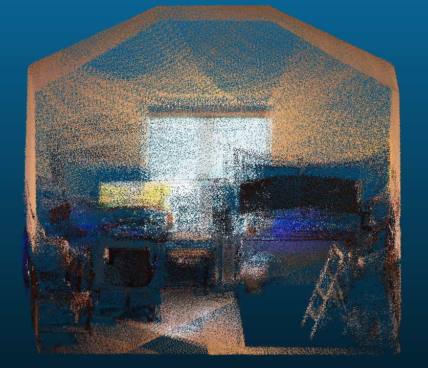

# Automated Terrestrial LiDAR Acquisition System (ATLAS)
*A low cost, open source hardware and software system for capturing physical environments using sensor fusion and a variety of 3D capture methods including terrestrial and SLAM.*

## Motivation
- In order to fully unlock the possibilities of 3D, a method for creating 3D content from physical spaces is needed to both test new capabilities and ingest as a new digital twin asset. Unfortunately for current 3D scanning systems, there is both a steep learning curve and a steep price (most scanners range from $1k-30k depending on hardware specifications and software licensing).

- This repository aims to provide a low-cost solution (~$1100 for new sensor setup) for building, deploying, and operating a 3D scanner (built from commercial-off-the-shelf components) for scanning physical environments and outputting dense colored point clouds. This solution includes both hardware and software components, as well as a setup guide to calibrate and test the system.
  > *Note: See `Hardware Build` section below for component estimates at the time of writing this.*

## Technical Approach

### Hardware
- LiDAR w/ IMU
    - [Livox Mid360](https://www.livoxtech.com/mid-360)
        - 360° * 59° FoV
        - Non-repeating
        - 0.1m-40m range
        - Range Precision³ (1σ)
            - ≤ 2 cm (@ 10m)
            - ≤ 3 cm (@ 0.2m)
        - Angular Precision（1σ）
            - < 0.15º
        - ICM40609 IMU
- Spherical (360 degree) Camera
    - [Insta360 One X2](https://www.insta360.com/product/insta360-onex2)
        - 4K max resolution at 30fps
- Compute
    - 3.4GHz Quad Core, x64 architecture
    - 16GB DDR4 RAM
    - 512 GB SSD
    - Integrated Graphics Processor
- Accessories (optional)
    - See `Hardware Build` section for more information
- Complete scanner with accessories
    - 8" wide x 8" tall x 14" deep
    - 7lb

#### OS
- Linux Ubuntu Jammy 22.04

#### TODO
- [x] Release v1.0.0 hardware build
- [x] Release software install guide
- [x] Enable terrestrial mode
- [x] Release calibration procedure
- [x] Implement scanning progress gui
- [ ] Release v1.0.0 code
- [ ] Release sample dataset
- [ ] Enable SLAM mode
- [ ] Replace direct_visual_lidar_calibration feature matcher with [OpenCV 2D matcher](https://docs.opencv.org/4.x/db/dd9/group__xfeatures2d__match.html)
- [ ] Implement remote capture capability

#### Overview
- Base System
    - [ROS2 Humble](https://docs.ros.org/en/humble/Releases/Release-Humble-Hawksbill.html) - ([Apache 2.0/BSD-3-clause](https://docs.ros.org/en/diamondback/api/licenses.html))
- Drivers
    - [livox_ros_driver2](https://github.com/Livox-SDK/livox_ros_driver2) - ([MIT](https://github.com/Livox-SDK/livox_ros_driver2?tab=License-1-ov-file#readme))
    - [insta360_ros_driver](https://github.com/ai4ce/insta360_ros_driver) - ([Apache 2.0](https://github.com/ai4ce/insta360_ros_driver?tab=Apache-2.0-1-ov-file#readme))
    - [Insta360 SDK](https://www.insta360.com/developer/home)
- Tools
    - Calibration
        - [koide3/direct_visual_lidar_calibration](https://github.com/koide3/direct_visual_lidar_calibration) - ([MIT](https://github.com/koide3/direct_visual_lidar_calibration/blob/main/README.md))
    - Global Mapping
        - [PRBonn/rko_lio](https://github.com/PRBonn/rko_lio) - ([MIT](https://github.com/PRBonn/rko_lio?tab=MIT-1-ov-file#readme))
    - Point Cloud Alignment/ICP
        - [Open3D](https://github.com/isl-org/Open3D) - ([MIT](https://github.com/isl-org/Open3D?tab=License-1-ov-file#readme))

#### ROS2 Details
- Published Topics
    - Lidar
        - /livox/lidar
            - ~10Hz
        - /livox/imu
            - ~200Hz
    - Camera
        - /dual_fisheye/image
            - ~0.2Hz
        - /dual_fisheye/image/compressed
            - ~30Hz
        - /equirectangular/image
            - ~0.4Hz
        - /imu/data
            - ~60Hz (not used)
        - /imu/data_raw
            - ~60Hz (not used)
    - Mapping
        - /rko_lio/odometry
            - ~10Hz
        - /rko_lio/odometry_buffered
            - ~10Hz
        - /tf
            - ~60Hz
- Transforms
    - odom → base_link → livox_frame
    - camera_to_lidar
        - Handled in image to lidar projection, uses extrinsic calibration obtained during calibration step
    - dual_fisheye_to_equirectangular_projection
        - Handled in camera driver, uses intrinsic calibration obtained during calibration step

#### Feature List
| **Feature**                         | Supported | Notes                                                                                                  |
| ------------------------------------| --------- | ------------------------------------------------------------------------------------------------------ |
| Intrinsic calibration               | No        | Currently using spherical camera, so not needed                                                        |
| Extrinsic calibration               | Yes       | Camera to lidar, dual fish-eye lens to ERP                                                             |
| Image acquisition                   | Yes       | Masked panos saved as 2.5K (2560 × 1280) - 4K on horizon                                               |
| Point cloud acquisition             | Yes       | Raw lidar with intensity saved with pose as ply                                                        |
| Colorize point cloud                | Yes       | Projects the image onto lidar using calibration                                                        |
| Blend panoramic image seams         | Yes       | Blend the cubemap face seams after calibration using simple weighting                                  |
| Export Colmap model files           | Yes       | Retriangulate poses, merges color pointcloud with colmap reconstructed point cloud                     |
| Record bag files                    | Yes       | Records lidar point cloud, trajectory, and images for 3 seconds per scan (mostly used for calibration) |
| Record trajectory                   | Yes       | Trajectory (poses) are stored locally and updated if using ICP refinement                              |
| Merge scans w/ trajectory or ICP    | Yes       | Refine poses by performing pose graph based ICP, initialized from the trajectory                       |
| Terrestrial mode (time-lapse scans) | Yes       | Currently triggered with button, mostly used for calibration and debug system/sensors                  |
| Scan progress gui                   | Yes       | Local map is updated in RVIZ and shown during scanning                                             |
| Sample gallery                      | Future    | Providing outputs to view various datasets taken with the scanner                                      |
| Slam mode                           | Future    | Automate terrestrial mode by automatically building and saving point cloud, trajectory, and images     |
| Remote capture capability           | Future    | Enable ability to remotely trigger a scan on the device                                                |

### Software Installation
Please review [Software Installation documentation](docs/software-install.md)

### Hardware Build
Please review [Hardware Build documentation](docs/atlas-hw-build-v1.pdf)

### Calibration
Please review [Calibration documentation](docs/calibration.md)

### Testing and Capturing
Please review [Running the Software documentation](docs/software-run.md)

#### Sample Output

#### Important Notes
- The system bottleneck is currently in the image acquisition and so the video frame rate and resolution was adjusted to account for this. The system acquisition is triggered when an image is acquired and ready to use, then the lidar data is captured. The color projection onto the point cloud happens in post processing. Rosbags are recorded during acquisition as a redundency capture mechanism.
