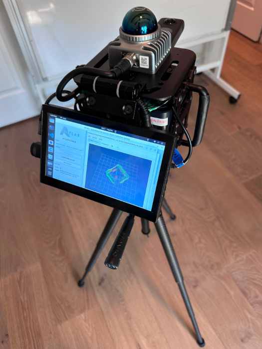
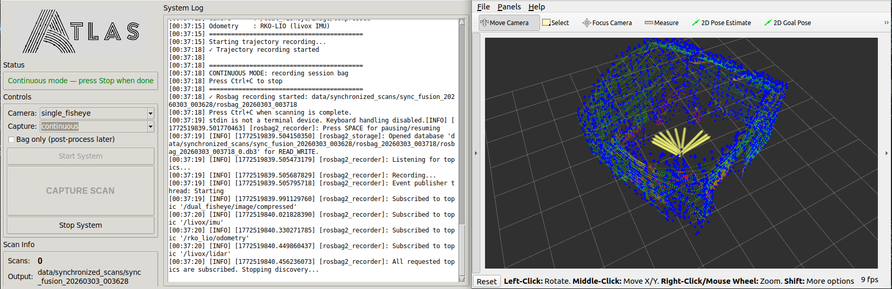
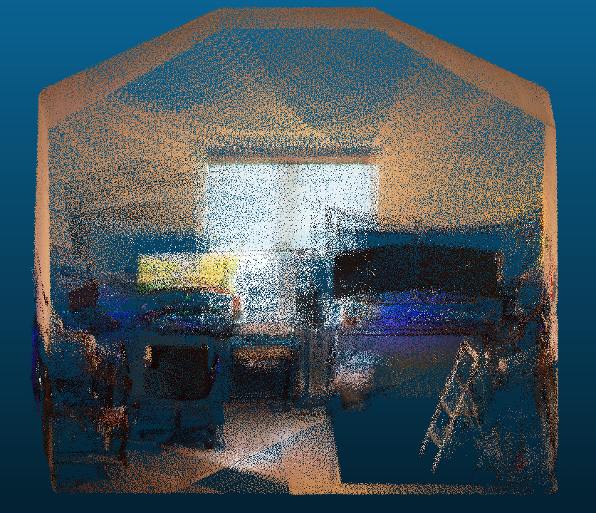

# Automated Terrestrial LiDAR Acquisition System (ATLAS)
*A low cost, open source hardware and software system for capturing physical environments using sensor fusion and a variety of 3D capture methods including terrestrial and SLAM.*

## Motivation
- In order to fully unlock the possibilities of 3D, a method for creating 3D content from physical spaces is needed to both test new capabilities and ingest as a new digital twin asset. Unfortunately for current 3D scanning systems, there is both a steep learning curve and a steep price (most scanners range from $1k-30k depending on hardware specifications and software licensing).

- This repository aims to provide a low-cost solution (~$1100 for new sensor setup) for building, deploying, and operating a 3D scanner (built from commercial-off-the-shelf components) for scanning physical environments and outputting dense colored point clouds. This solution includes both hardware and software components, as well as a setup guide to calibrate and test the system.
  > *Note: See `Hardware Build` section below for component estimates at the time of writing this.*

## Technical Approach

### Hardware
- LiDAR w/ IMU
    - [Livox Mid360](https://www.livoxtech.com/mid-360)
        - 360° * 59° FoV
        - Non-repeating
        - 0.1m-40m range
        - Range Precision³ (1σ)
            - ≤ 2 cm (@ 10m)
            - ≤ 3 cm (@ 0.2m)
        - Angular Precision（1σ）
            - < 0.15º
        - ICM40609 IMU
- Spherical (360 degree) Camera
    - [Insta360 One X2](https://www.insta360.com/product/insta360-onex2)
        - 4K max resolution at 30fps
- Compute
    - 3.4GHz Quad Core, x64 architecture
    - 16GB DDR4 RAM
    - 512 GB SSD
    - Integrated Graphics Processor
- Accessories (optional)
    - See `Hardware Build` section for more information
- Complete scanner with accessories
    - 8" wide x 8" tall x 14" deep
    - 7lb

#### OS
- Linux Ubuntu Jammy 22.04

#### TODO
- [x] Release v1.0.0 hardware build
- [x] Release software install guide
- [x] Enable terrestrial mode
- [x] Release calibration procedure
- [x] Implement scanning progress gui
- [x] Enable SLAM (continuous) mode
- [ ] Release v1.0.0 code
- [ ] Release sample dataset

- [ ] Replace direct_visual_lidar_calibration feature matcher with [OpenCV 2D matcher](https://docs.opencv.org/4.x/db/dd9/group__xfeatures2d__match.html)
- [ ] Implement remote capture capability

#### Overview
- Base System
    - [ROS2 Humble](https://docs.ros.org/en/humble/Releases/Release-Humble-Hawksbill.html) - ([Apache 2.0/BSD-3-clause](https://docs.ros.org/en/diamondback/api/licenses.html))
- Drivers
    - [livox_ros_driver2](https://github.com/Livox-SDK/livox_ros_driver2) - ([MIT](https://github.com/Livox-SDK/livox_ros_driver2?tab=License-1-ov-file#readme))
    - [insta360_ros_driver](https://github.com/ai4ce/insta360_ros_driver) - ([Apache 2.0](https://github.com/ai4ce/insta360_ros_driver?tab=Apache-2.0-1-ov-file#readme))
    - [Insta360 SDK](https://www.insta360.com/developer/home)
- Tools
    - Calibration
        - [koide3/direct_visual_lidar_calibration](https://github.com/koide3/direct_visual_lidar_calibration) - ([MIT](https://github.com/koide3/direct_visual_lidar_calibration/blob/main/README.md))
    - Global Mapping
        - [PRBonn/rko_lio](https://github.com/PRBonn/rko_lio) - ([MIT](https://github.com/PRBonn/rko_lio?tab=MIT-1-ov-file#readme))
    - Point Cloud Alignment/ICP
        - [Open3D](https://github.com/isl-org/Open3D) - ([MIT](https://github.com/isl-org/Open3D?tab=License-1-ov-file#readme))

#### ROS2 Details
- Published Topics
    - Lidar
        - /livox/lidar
            - ~10Hz
        - /livox/imu
            - ~200Hz
    - Camera
        - /dual_fisheye/image/compressed
            - ~30Hz (throttled to 15fps in continuous mode before recording)
        - /dual_fisheye/image/compressed_15fps
            - ~15Hz (continuous mode only — throttled topic used for bag recording)
        - /imu/data_raw
            - ~60Hz (camera IMU fallback, used only if Livox IMU unavailable)
    - Mapping
        - /rko_lio/odometry
            - ~10Hz
        - /rko_lio/odometry_buffered
            - ~10Hz
        - /tf
            - ~60Hz
- Transforms
    - odom → base_link → livox_frame
    - camera_to_lidar
        - Handled in post-processing color projection, uses extrinsic calibration obtained during calibration step
    - dual_fisheye_to_equirectangular
        - Handled internally by the camera driver at launch, not a TF transform

#### Software Feature List

| **Feature**                         | Supported | Notes                                                                                                            |
| ------------------------------------| --------- | ---------------------------------------------------------------------------------------------------------------- |
| Intrinsic calibration               | No        | Currently modeling as spherical camera, even single fisheye is projected to spherical model to maximize coverage |
| Extrinsic calibration               | Yes       | Camera to lidar, dual fish-eye lens to ERP                                                                       |
| Image acquisition                   | Yes       | Masked panos saved as 2.5K (2560 × 1280) - 4K on roadmap                                                         |
| Point cloud acquisition             | Yes       | Raw lidar with intensity saved with pose as .ply or optionally .e57                                              |
| Colorize point cloud                | Yes       | Projects the image onto lidar using calibration                                                                  |
| Blend panoramic image seams         | Yes       | Blend the cubemap face seams after calibration using simple weighting                                            |
| Export Colmap model files           | Yes       | Retriangulate poses, merges color pointcloud with colmap reconstructed point cloud                               |
| Record bag files                    | Yes       | Records lidar point cloud, trajectory, and images for 3 seconds per scan (mostly used for calibration)           |
| Record trajectory                   | Yes       | Trajectory (poses) are stored locally and updated if using ICP refinement                                        |
| Merge scans w/ trajectory or ICP    | Yes       | Refine poses by performing pose graph based ICP, initialized from the trajectory                                 |
| Terrestrial mode (time-lapse scans) | Yes       | Currently triggered with button, mostly used for calibration and debug system/sensors                            |
| Scan progress gui                   | Yes       | Local map is updated in RVIZ and shown during scanning                                                           |
| Slam mode (continuous scanning)     | Yes       | Automate terrestrial mode by automatically building and saving point cloud, trajectory, and images               |
| Sample gallery                      | Future    | Providing outputs to view various datasets taken with the scanner                                                |
| Remote capture capability           | Future    | Enable ability to remotely trigger a scan on the device                                                          |

### Software Installation
Please review [Software Installation documentation](docs/software-install.md)

### Hardware Build
Please review [Hardware Build documentation](docs/atlas-hw-build-v1.pdf)

### Calibration
Please review [Calibration documentation](docs/calibration.md)

### Testing and Capturing
Please review [Running the Software documentation](docs/software-run.md)

#### Sample Output

#### Important Notes
- Two capture modes are supported: stationary (manual trigger per scan) and continuous (full session recorded as a single rosbag, then reconstructed into individual scans at shutdown)

- Acquisition is camera-triggered — the system waits for a valid camera frame before proceeding, making image availability the primary bottleneck

- In single fisheye mode, the camera driver is reniced to priority 15 to reduce CPU competition; the LIO estimator is given priority -15 (highest) to keep odometry stable

- In continuous mode, the camera is throttled from 30fps to 15fps before recording to reduce bag write load

- A rosbag is recorded for every scan (stationary) or the entire session (continuous) as a redundancy capture mechanism — raw data can be replayed or reprocessed independently of the live pipeline

- Color projection onto the point cloud is done entirely in post-processing, not during live capture

- If the primary camera capture fails, the system automatically falls back to a buffered camera capture, then a LiDAR-driven capture as a last resort

- RKO-LIO odometry requires an IMU — the system prefers the Livox Mid360's built-in IMU, falling back to the camera IMU if unavailable; if neither is found, odometry is disabled

- Calibration is reloaded from calib.json at startup by default; set USE_EXISTING_CALIBRATION=true to skip this step

- A sync benchmark report (sync_benchmark.json) is automatically generated at the end of each session to validate sensor timing alignment

#### Process & Worker Management

- Each sensor node (camera driver, LiDAR driver, RKO-LIO, rosbag recorder, trajectory recorder, etc.) runs as a dedicated OS process

- CPU priority is managed via nice/renice — RKO-LIO gets highest priority (-15), rosbag recorder lowest (+10), camera drivers in between

- All PIDs are tracked and bulk-terminated on exit via a trap cleanup handler bound to SIGINT, SIGTERM, and EXIT

- The trajectory recorder is given a graceful shutdown window to flush any pending scan saves before being killed

- There is no thread pool or worker queue — OS-level process isolation and nice values are the sole concurrency control mechanism
