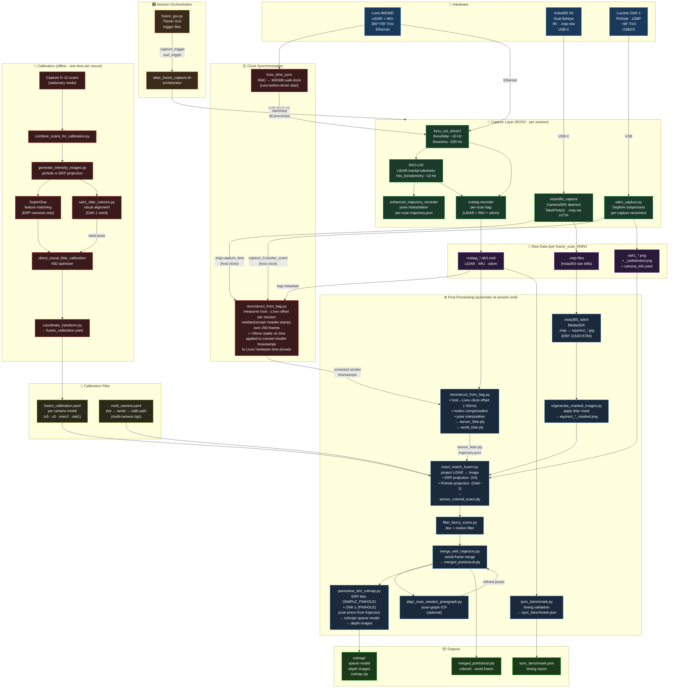

```mermaid
flowchart TD
    %% ─── HARDWARE ────────────────────────────────────────────────────────────
    subgraph HW["🔩 Hardware"]
        direction LR
        MID360["Livox MID360\nLiDAR + IMU\n360°×59° FoV\nEthernet"]
        X5["Insta360 X5\nDual fisheye\n8K · .insp raw\nUSB-C"]
        OAK1["Luxonis OAK-1\nPinhole · 12MP\n~66° FoV\nUSB2/3"]
    end

    %% ─── CLOCK SYNC ─────────────────────────────────────────────────────────
    subgraph CLKSYNC["🕐 Clock Synchronisation"]
        direction TB
        livox_time_sync["livox_time_sync\nRMC → MID360 wall-clock\n(runs before driver start)"]
        ClockNote["reconstruct_from_bag.py\nmeasures host→Livox offset per session\nmedian(receipt−header.stamp) over 200 frames\n≈ +65ms stable ±0.3ms\napplied to convert shutter timestamps\nto Livox hardware time domain"]
    end
    MID360 --> livox_time_sync
    livox_time_sync -->|"wall-clock set"| LidarDriver
    Bag -->|"bag metadata"| ClockNote
    InstaCapture -->|".insp.capture_time\n(host clock)"| ClockNote
    OAK1Cap -->|"capture_0.shutter_event\n(host clock)"| ClockNote
    ClockNote -->|"corrected shutter\ntimestamps"| Reconstruct

    %% ─── CAPTURE LAYER ───────────────────────────────────────────────────────
    subgraph CAP["📡 Capture Layer  (ROS2 · per session)"]
        direction TB
        LidarDriver["livox_ros_driver2\n/livox/lidar  ~10 Hz\n/livox/imu  ~200 Hz"]
        RKOLIO["RKO-LIO\nLiDAR-inertial odometry\n/rko_lio/odometry  ~10 Hz"]
        TrajRec["enhanced_trajectory_recorder\npose interpolation\nper-scan trajectory.json"]
        BagRec["rosbag recorder\nper-scan bag\n(LiDAR + IMU + odom)"]
        InstaCapture["insta360_capture\nCameraSDK daemon\nTakePhoto() · .insp via HTTP"]
        OAK1Cap["oak1_capture.py\nDepthAI subprocess\nper-capture reconnect"]
    end

    MID360 -->|Ethernet| LidarDriver
    X5 -->|USB-C| InstaCapture
    OAK1 -->|USB| OAK1Cap

    LidarDriver --> RKOLIO
    LidarDriver --> BagRec
    RKOLIO --> TrajRec
    RKOLIO --> BagRec

    %% ─── SESSION ORCHESTRATION ───────────────────────────────────────────────
    subgraph ORCH["🎛️ Session Orchestration"]
        Shell["atlas_fusion_capture.sh\norchestrator"]
        GUI["fusion_gui.py\nTkinter GUI\ntrigger files"]
    end

    GUI -->|".capture_trigger\n.quit_trigger"| Shell
    Shell -->|"start/stop\nall processes"| CAP

    %% ─── RAW DATA ────────────────────────────────────────────────────────────
    subgraph RAW["💾 Raw Data  (per fusion_scan_NNN/)"]
        direction LR
        Bag["rosbag_*.db3.zstd\nLiDAR · IMU · odom"]
        INSP[".insp files\n(Insta360 raw stills)"]
        OAK1PNG["oak1_*.png\n+ _undistorted.png\n+ camera_info.yaml"]
    end

    BagRec --> Bag
    InstaCapture --> INSP
    OAK1Cap --> OAK1PNG

    %% ─── POST-PROCESSING ─────────────────────────────────────────────────────
    subgraph POST["⚙️ Post-Processing  (automatic at session end)"]
        direction TB

        Reconstruct["reconstruct_from_bag.py\n• host→Livox clock offset (~65ms)\n• motion compensation\n• pose interpolation\n→ sensor_lidar.ply\n→ world_lidar.ply"]

        Stitch["insta360_stitch\nMediaSDK\n.insp → equirect_*.jpg\n(ERP 11520×5760)"]

        MaskColor["regenerate_masked_images.py\napply lidar mask\n→ equirect_*_masked.png"]

        Colorize["exact_match_fusion.py\nproject LiDAR → image\n• ERP projection  (X5)\n• Pinhole projection  (OAK-1)\n→ sensor_colored_exact.ply"]

        Filter["filter_blurry_scans.py\nblur + motion filter"]

        Merge["merge_with_trajectory.py\nworld-frame merge\n→ merged_pointcloud.ply"]

        ICP["align_scan_session_posegraph.py\npose-graph ICP\n(optional)"]

        COLMAP["panorama_sfm_colmap.py\nERP tiles (SIMPLE_PINHOLE)\n+ OAK-1 (PINHOLE)\npose priors from trajectory\n→ colmap/ sparse model\n→ depth images"]

        Benchmark["sync_benchmark.py\ntiming validation\n→ sync_benchmark.json"]
    end

    Bag --> Reconstruct
    INSP --> Stitch
    Stitch --> MaskColor
    MaskColor --> Colorize
    OAK1PNG --> Colorize
    Reconstruct -->|"sensor_lidar.ply\ntrajectory.json"| Colorize
    Colorize --> Filter
    Filter --> Merge
    Merge --> ICP
    ICP -->|"refined poses"| Merge
    Merge --> COLMAP
    Bag --> Benchmark

    %% ─── OUTPUTS ─────────────────────────────────────────────────────────────
    subgraph OUT["📦 Outputs"]
        direction LR
        PLY["merged_pointcloud.ply\ncolored · world frame"]
        ColmapOut["colmap/\nsparse model\ndepth images\ncolmap.zip"]
        BenchOut["sync_benchmark.json\ntiming report"]
    end

    Merge --> PLY
    COLMAP --> ColmapOut
    Benchmark --> BenchOut

    %% ─── CALIBRATION (offline) ───────────────────────────────────────────────
    subgraph CALIB["🔧 Calibration  (offline · one-time per mount)"]
        direction LR
        CalCapture["Capture 5–10 scans\n(stationary mode)"]
        CombineScans["combine_scans_for_calibration.py"]
        GenIntensity["generate_intensity_images.py\npinhole or ERP projection"]
        SuperGlue["SuperGlue\nfeature matching\n(ERP cameras only)"]
        DVL["direct_visual_lidar_calibration\nNID optimizer"]
        CoordXform["coordinate_transform.py\n→ fusion_calibration.yaml"]
        OAK1Cal["oak1_lidar_colorize.py\nvisual alignment\n(OAK-1 seed)"]
    end

    CalCapture --> CombineScans
    CombineScans --> GenIntensity
    GenIntensity --> SuperGlue
    SuperGlue --> DVL
    GenIntensity --> OAK1Cal
    OAK1Cal -->|"seed pose"| DVL
    DVL --> CoordXform

    subgraph CalibFiles["📄 Calibration Files"]
        FusionYAML["fusion_calibration.yaml\nper camera model\n(x5 · x3 · onex2 · oak1)"]
        MultiCamYAML["multi_camera.yaml\nslot → serial → calib path\n(multi-camera rigs)"]
    end

    CoordXform --> FusionYAML
    FusionYAML --> Colorize
    MultiCamYAML --> Colorize

    %% ─── STYLING ─────────────────────────────────────────────────────────────
    classDef hw fill:#1a3a5c,stroke:#4a9eff,color:#fff
    classDef capture fill:#1a3a2a,stroke:#4aff7a,color:#fff
    classDef orch fill:#3a2a1a,stroke:#ffaa4a,color:#fff
    classDef raw fill:#2a1a3a,stroke:#aa4aff,color:#fff
    classDef post fill:#1a2a3a,stroke:#4aaaff,color:#fff
    classDef out fill:#1a3a1a,stroke:#4aff4a,color:#fff
    classDef calib fill:#3a1a1a,stroke:#ff4a4a,color:#fff
    classDef files fill:#2a2a1a,stroke:#ffff4a,color:#fff

    class MID360,X5,OAK1 hw
    class LidarDriver,RKOLIO,TrajRec,BagRec,InstaCapture,OAK1Cap capture
    class livox_time_sync,ClockNote calib
    class Shell,GUI orch
    class Bag,INSP,OAK1PNG raw
    class Reconstruct,Stitch,MaskColor,Colorize,Filter,Merge,ICP,COLMAP,Benchmark post
    class PLY,ColmapOut,BenchOut out
    class CalCapture,CombineScans,GenIntensity,SuperGlue,DVL,CoordXform,OAK1Cal calib
    class FusionYAML,MultiCamYAML files
```
