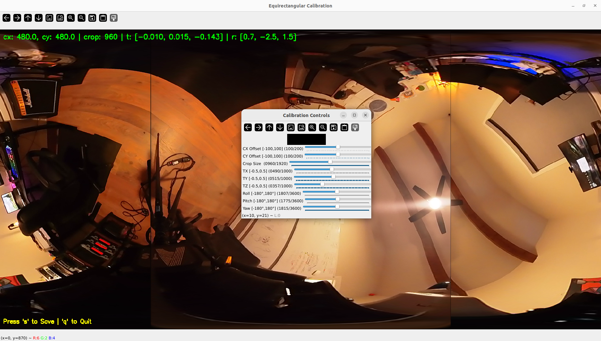

# Calibration Procedure
> *Note: Ensure the camera is turned on and the software installation procedure was successful before performing calibration*

- Bring up the camera to calibrate
    ```bash
    sudo ~/atlas_ws/src/atlas-scanner/src/setup_camera_permissions.sh &&
    cd ~/atlas_ws &&
    source ~/atlas_ws/install/setup.bash &&
    ros2 launch insta360_ros_driver bringup.launch.xml equirectangular:=true
    ```

## Dual Fisheye to Equirectangular Calibration
- This calibration will transform the dual fisheye lens into equirectangular frames
- Equirectangular calibration file location
    - `~/atlas_ws/src/insta360_ros_driver/config/equirectangular.yaml`
    - Use these as starting parameters
        ```bash
        ==================================================
        CALIBRATION PARAMETERS (YAML FORMAT)
        ==================================================
        equirectangular_node:
        ros__parameters:
            cx_offset: 0.0
            cy_offset: 0.0
            crop_size: 960
            translation: [-0.007, 0.007, -0.153]
            rotation_deg: [0.7, -3.0, 1.5]
            gpu: false
            out_width: 1920
            out_height: 960
        ==================================================
        ```

- In a separate command window, with the camera running in another window, source the ROS2 workspace
    ```bash
    cd ~/atlas_ws &&
    source install/setup.bash
    ```

- Start the equirectangular calibration, adjust the sliders slightly to align all of the views
    ```bash
    export QT_QPA_PLATFORM=xcb
    ros2 run insta360_ros_driver equirectangular.py --calibrate --auto-update --ros-args --params-file ~/atlas_ws/src/insta360_ros_driver/config/equirectangular.yaml
    ```
    > **Tips for calibration:**
    > * Try to adjust `CX`, `CY`, `Crop Size` as little as possible for best results.
    > * First, adjust `TZ` until the middle of the equirectangular image is aligned.
    > * Next, adjust `Pitch` so the cameras are centered from from left to right.
    > * Adjust other translation and rotation values as needed to get a rough calibration.
    > * Ensure atleast the center and right regions of the image are aligned. The left region of the image is not as important because that will primarily be hidden from the lidar.
    > * Once a coarse calibration is complete, rotate the camera on the tripod with the calibration running to ensure the regions align in various configurations.



- When satisfied with the calibration, press `s` to save the calibration to file

> *Note: As a back-up, copy the `Translation` and `Rotation` parameters from the command line. Ensure the file at `~/atlas_ws/src/insta360_ros_driver/config/equirectangular.yaml` does have these saved values before continuing.*


## Equirectangular to Lidar Calibration
- This calibration will transform the camera equirectangular frame into the lidar frame
- Calibration file locations
    - `~/atlas_ws/output/calib.json`
        - This intermediate file is used to pre-process the calibration since we are using bag files and a series of scans to perform the calibration
    - `~/atlas_ws/src/atlas-scanner/src/config/fusion_calibration.yaml`
        - This will be where the final extrinsic calibration will be saved and used for the fusion capture

- Procedure
    1. Ensure both the Lidar and Camera are powered on. Capture new data of at least **1** scan. This will be used to create a mask for the equirectangular image.
        ```bash
        mkdir -p ~/atlas_ws/output
        cat > ~/atlas_ws/output/calib.json << 'EOF'
        {
        "T_lidar_camera": [
            [1, 0, 0, 0],
            [0, 1, 0, 0],
            [0, 0, 1, 0],
            [0, 0, 0, 1]
        ]
        }
        EOF

        cd ~/atlas_ws/src/atlas-scanner/src
        sudo ./setup_camera_permissions.sh
        ./terrestrial_fusion_with_lio.sh
        ```
        > *Note: Take note of the session directory from the console output. It will be in the form: `~/atlas_ws/data/synchronized_scans/sync_fusion_{TIMESTAMP}/`*

    2. Create a mask image for your setup
        * The mask defines which parts of the equirectangular image to use for coloring (white = use, black = ignore)
        * This will help with calibration so the algorithm doesn't get false positive features to use
        * You can use the image cloned from this repo at `~/atlas_ws/src/atlas-scanner/src/lidar_mask.png`, but the mask won't match your exact setup so quality might be affected. It is advised to use the manual method below
            * Use existing ERP image took above, edit inside an image editor program. The path to the image will be similar to `~/atlas_ws/data/synchronized_scans/sync_fusion_{TIMESTAMP}/fusion_scan_001/equirect_{TIMESTAMP}.jpg`
            * Create a black/white PNG where white = use, black = ignore. We want to ignore the scanner and tripod in the spherical images. Also take note that the lidar only sees most of the top view camera and a small portion of the bottom view camera. This means that most of the bottom camera data will be discarded once the image to point cloud projection occurs
            * Recommended size: 1920x960 (matching equirectangular output)
            * Save new image mask to: ~/atlas_ws/src/atlas-scanner/src/lidar_mask.png

        > *Note: You can use any image editor (GIMP, Photoshop, etc.) to create the mask. Paint white areas where you want to apply colors from the camera, and black areas to ignore (e.g., areas with the scanner itself visible).*

    3. Capture new data of at least **10** scans from varying positions/rotations in same room. These scans will be used for the calibration procedure.
        ```bash
        cd ~/atlas_ws/src/atlas-scanner/src
        sudo ./setup_camera_permissions.sh
        ./terrestrial_fusion_with_lio.sh
        ```
        > *Note: Take note of the session directory from the console output. It will be in the form: `~/atlas_ws/data/synchronized_scans/sync_fusion_{TIMESTAMP}/`*

        > *Note: The script will pull in default extrinsic values during this capture, but we won't be using the colored point cloud during calibration so this behavior is ok. We process the image and point cloud seperately below and then populate the extrinsic calibration with the new values*

    3. Combine all scans into a single calibration dataset. Replace {TIMESTAMP} with the scans from above.
        ```bash
        cd ~/atlas_ws/src/atlas-scanner/src/calibration
        python3 combine_scans_for_calibration.py ~/atlas_ws/data/synchronized_scans/sync_fusion_{TIMESTAMP}
        ```
        > *Note: This will merge all scans into `~/atlas_ws/output` for calibration.*

    4. Get initial guess
        - Manual
            - Recommended for commercial applications and is more reliable.
            - Match atleast 5 image-to-pointcloud features in each bag file.
            - After each pair, select `Add Picked Points`.
            - When all points are marked for all bags, select `Estimate`.
            - If the estimation was successful, select `Save` to save the calibration parameters to `~/atlas_ws/output/calib.json`
            ```bash
            cd ~/atlas_ws/install/direct_visual_lidar_calibration/lib/direct_visual_lidar_calibration
            ./initial_guess_manual --data_path ~/atlas_ws/output
            ```
        - Auto
            - Recommended for research projects, quick but can struggle in some configurations
            ```bash
            python3 ~/atlas_ws/src/atlas-scanner/src/calibration/generate_intensity_images.py ~/atlas_ws/output
            cd ~/atlas_ws/install/direct_visual_lidar_calibration/lib/direct_visual_lidar_calibration
            python3 ./find_matches_superglue.py ~/atlas_ws/output --superglue indoor
            ./initial_guess_auto ~/atlas_ws/output
            python3 -c "import json; f=open('~/atlas_ws/output/calib.json'.replace('~','$HOME'),'r+'); d=json.load(f); d['results']['init_T_lidar_camera']=d['results']['init_T_lidar_camera_auto']; f.seek(0); json.dump(d,f,indent=2); f.truncate()"
            ```

    5. Run calibration
        ```bash
        cd ~/atlas_ws/install/direct_visual_lidar_calibration/lib/direct_visual_lidar_calibration
        ./calibrate --data_path ~/atlas_ws/output
        ```
        > *Note: Check that the calibration worked and that the point cloud corresponds to the ERP image. Use the `blend` slider to reveal both the point cloud and image.*

    6. Extract and apply new calibration
        ```bash
        python3 ~/atlas_ws/src/atlas-scanner/src/calibration/coordinate_transform.py \
            ~/atlas_ws/src/atlas-scanner/src
        ```
        > *Note: This will properly invert the transformation from calib.json and save to: `~/atlas_ws/src/atlas-scanner/src/config/fusion_calibration.yaml`*
        
        > *Important: Do NOT use extract_calibration.py - it doesn't invert the transformation correctly!*

    7. Configuration notes for `~/atlas_ws/src/atlas-scanner/src/config/fusion_calibration.yaml`
        * The system uses exact projection matching the calibration tool
        * All transformation values come directly from inverted calib.json
        * No manual adjustments needed - alignment matches calibration tool exactly
        * Baseline Settings

            ```bash
            roll_offset: 3.084333895782295
            pitch_offset: 0.016921463456919694
            yaw_offset: -1.6041524644977394
            manual_roll_adjustment: 0.0
            manual_pitch_adjustment: 0.0
            manual_yaw_adjustment: 0.0
            azimuth_offset: 0.0
            elevation_offset: 0.0
            x_offset: 0.03272758164346094
            y_offset: 0.13525142783960337
            z_offset: 0.1495769332683098
            flip_x: false
            flip_y: false
            image_width: 1920
            image_height: 960
            use_fisheye: false
            skip_rate: 5
            ```

    7. Now you are ready to capture! Go to [the Software Run doc](software-run.md) to start scanning!

    >***Note: If the color on your point cloud seems to be misaligned, rerun the procedure above until results are satisfactory***
