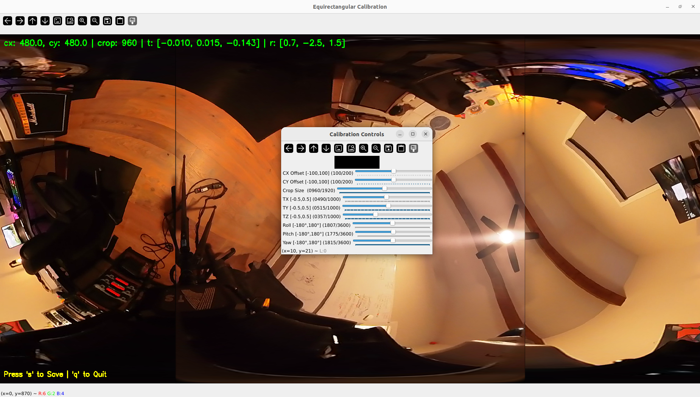
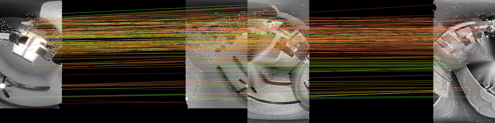
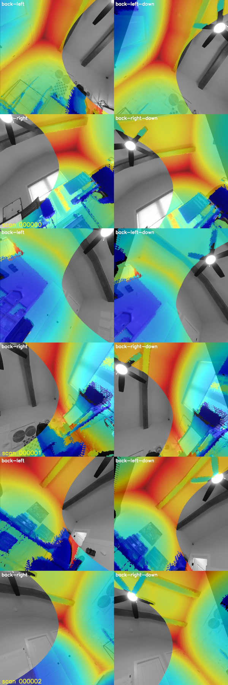

# Calibration Procedure
> *Note: Ensure the camera is turned on and the software installation procedure was successful before performing calibration*

- Bring up the camera to calibrate
    ```bash
    sudo ~/atlas_ws/src/atlas-scanner/src/setup_camera_permissions.sh &&
    cd ~/atlas_ws &&
    source ~/atlas_ws/install/setup.bash &&
    ros2 launch insta360_ros_driver bringup.launch.xml equirectangular:=true
    ```

## Fisheye to Equirectangular Calibration
> *Note: This step is required for both `single_fisheye` and `dual_fisheye` modes. Both modes use the equirectangular pipeline for ERP projection and point cloud coloring. Using dual cameras will increase coverage, but will also tax the system. Calibrating the two fisheye cameras together can sometimes be tricky due to blind spots being introduced.*
- This calibration will transform the fisheye lens(es) into equirectangular frames
- Equirectangular calibration file location
    - `~/atlas_ws/src/insta360_ros_driver/config/equirectangular.yaml`
    - Use these as starting parameters
        ```bash
        ==================================================
        CALIBRATION PARAMETERS (YAML FORMAT)
        ==================================================
        equirectangular_node:
        ros__parameters:
            cx_offset: 0.0
            cy_offset: 0.0
            crop_size: 1920
            translation: [-0.007, 0.007, -0.153]
            rotation_deg: [0.7, -3.0, 1.5]
            gpu: false
            out_width: 3840
            out_height: 1920
        ==================================================
        ```

- In a separate command window, with the camera running in another window, source the ROS2 workspace
    ```bash
    cd ~/atlas_ws &&
    source install/setup.bash
    ```

- Start the equirectangular calibration, adjust the sliders slightly to align all of the views
    ```bash
    export QT_QPA_PLATFORM=xcb
    ros2 run insta360_ros_driver equirectangular.py --calibrate --auto-update --ros-args --params-file ~/atlas_ws/src/insta360_ros_driver/config/equirectangular.yaml
    ```
    > **Tips for calibration:**
    > * Try to adjust `CX`, `CY`, `Crop Size` as little as possible for best results.
    > * First, adjust `TZ` until the middle of the equirectangular image is aligned.
    > * Next, adjust `Pitch` so the cameras are centered from from left to right.
    > * Adjust other translation and rotation values as needed to get a rough calibration.
    > * Ensure atleast the center and right regions of the image are aligned. The left region of the image is not as important because that will primarily be hidden from the lidar.
    > * Once a coarse calibration is complete, rotate the camera on the tripod with the calibration running to ensure the regions align in various configurations.



- When satisfied with the calibration, press `s` to save the calibration to file

> *Note: As a back-up, copy the `Translation` and `Rotation` parameters from the command line. Ensure the file at `~/atlas_ws/src/insta360_ros_driver/config/equirectangular.yaml` does have these saved values before continuing.*


## Equirectangular to Lidar Calibration
- This calibration will transform the camera equirectangular frame into the lidar frame
- Calibration file locations
    - `~/atlas_ws/output/calib.json`
        - Intermediate file used by `direct_visual_lidar_calibration`. Contains the raw `T_lidar_camera` result from the calibration tool.
    - `~/atlas_ws/src/atlas-scanner/src/config/fusion_calibration.yaml`
        - Final extrinsic calibration used by the fusion capture pipeline. Generated by `coordinate_transform.py` which correctly inverts `T_lidar_camera` to `T_camera_lidar`.

- Procedure
    1. Ensure both the Lidar and Camera are powered on. Capture new data of at least **1** scan. This will be used to create a mask for the equirectangular image.
        ```bash
        cd ~/atlas_ws/src/atlas-scanner/src
        ./atlas_fusion_capture.sh --capture stationary --camera dual_fisheye
        ```
        > *Note: Choose `--camera dual_fisheye` for full 360° equirectangular coverage.*

        > *Note: Take note of the session directory from the console output. It will be in the form: `~/atlas_ws/data/synchronized_scans/sync_fusion_{TIMESTAMP}/`*

    2. Create a mask image for your setup
        * The mask defines which parts of the equirectangular image to use for coloring (white = use, black = ignore)
        * This will help with calibration so the algorithm doesn't get false positive features to use
        * You can use the image cloned from this repo at `~/atlas_ws/src/atlas-scanner/src/lidar_mask_{single/dual}.png`, but the mask won't match your exact setup so quality might be affected. It is advised to use the manual method below
            * Use the ERP image captured above. The path will be similar to `~/atlas_ws/data/synchronized_scans/sync_fusion_{TIMESTAMP}/fusion_scan_001/equirect_{TIMESTAMP}.jpg`
            * Create a black/white PNG where white = use, black = ignore. Ignore the scanner body and tripod. Note that the lidar only sees the top camera hemisphere — most of the bottom camera data will be discarded during projection.
            * Recommended size: 3840x1920 (matching equirectangular output)
            * Save to: `~/atlas_ws/src/atlas-scanner/src/lidar_mask_single.png` (or `lidar_mask_dual.png` for dual fisheye)

        > *Note: You can use any image editor (GIMP, Photoshop, etc.) to create the mask.*

    3. Capture at least **5** scans from varying positions/rotations in the same room for the calibration dataset.
        ```bash
        cd ~/atlas_ws/src/atlas-scanner/src
        ./atlas_fusion_capture.sh --capture stationary --camera dual_fisheye
        ```
        > *Note: Take note of the session directory. More scans (up to ~10) improve calibration quality but 5 is typically sufficient.*

    4. Combine scans into a single calibration dataset. Replace `{TIMESTAMP}` with the session from step 3.
        ```bash
        python3 ~/atlas_ws/src/atlas-scanner/src/calibration/combine_scans_for_calibration.py \
            ~/atlas_ws/data/synchronized_scans/sync_fusion_{TIMESTAMP}
        ```
        > *Note: This merges all scans into `~/atlas_ws/output` for calibration. Any existing calibration result in `calib.json` is preserved as the initial guess.*

    5. Get initial guess
        - Manual *(recommended — more reliable)*
            - Match at least 5 image-to-pointcloud feature pairs in each bag file.
            - After each pair, select `Add Picked Points`. When all bags are done, select `Estimate` then `Save`.
            ```bash
            cd ~/atlas_ws/install/direct_visual_lidar_calibration/lib/direct_visual_lidar_calibration
            ./initial_guess_manual --data_path ~/atlas_ws/output
            ```
        - Auto *(quick but can struggle with single-fisheye setups)*
            ```bash
            python3 ~/atlas_ws/src/atlas-scanner/src/calibration/generate_intensity_images.py ~/atlas_ws/output
            cd ~/atlas_ws/install/direct_visual_lidar_calibration/lib/direct_visual_lidar_calibration
            python3 ./find_matches_superglue.py ~/atlas_ws/output --superglue indoor
            python3 ~/atlas_ws/src/atlas-scanner/src/calibration/fix_matches.py ~/atlas_ws/output
            ./initial_guess_auto ~/atlas_ws/output
            python3 -c "import json; f=open('$HOME/atlas_ws/output/calib.json','r+'); d=json.load(f); d['results']['init_T_lidar_camera']=d['results']['init_T_lidar_camera_auto']; f.seek(0); json.dump(d,f,indent=2); f.truncate()"
            ```
            - View matches visually to check quality (lines should be roughly parallel):
            ```bash
            eog ~/atlas_ws/output/000000_superglue.png
            ```
            

    6. Run calibration using the initial guess from step 5
        ```bash
        cd ~/atlas_ws/install/direct_visual_lidar_calibration/lib/direct_visual_lidar_calibration
        ./calibrate --data_path ~/atlas_ws/output \
            --nid_bins 32 \
            --nelder_mead_convergence_criteria 1e-10
        ```
        > *Note: Check the overlay in the viewer using the `blend` slider. When satisfied, save the result.*

        > *Note: If you want to start from the current known-good calibration instead of the auto initial guess (e.g. for fine refinement), run `seed_calib.py` first:*
        > ```bash
        > python3 ~/atlas_ws/src/atlas-scanner/src/calibration/seed_calib.py
        > ```

    7. Extract and apply new calibration
        ```bash
        python3 ~/atlas_ws/src/atlas-scanner/src/calibration/coordinate_transform.py \
            ~/atlas_ws/src/atlas-scanner/src
        ```
        > *Note: This inverts `T_lidar_camera` from `calib.json` to `T_camera_lidar` and saves it to `fusion_calibration.yaml`.*

    8. Verify calibration alignment
        - Generate perspective overlay images of LiDAR points on the camera image to visually confirm alignment
        ```bash
        python3 ~/atlas_ws/src/atlas-scanner/src/calibration/tune_calibration.py --verify
        eog ~/atlas_ws/output/calib_sweep/current.jpg
        ```
        > *Note: Uses `~/atlas_ws/output/000000.ply` and `000000.png` directly — no timestamp needed. Points should land on the correct surfaces. If near objects (blue) are offset but far objects (red) are aligned, this indicates a translation error. If all objects shift by the same amount, this indicates a rotation error.*

        - If fine-tuning is needed, sweep an axis to find the correct adjustment:
        ```bash
        # Sweep a single axis (roll/pitch/yaw in degrees, tx/ty/tz in cm)
        python3 ~/atlas_ws/src/atlas-scanner/src/calibration/tune_calibration.py \
            --axis pitch --range 2.0 --steps 5
        # Browse the generated images in ~/atlas_ws/output/calib_sweep/
        # Then apply the best offset:
        python3 ~/atlas_ws/src/atlas-scanner/src/calibration/tune_calibration.py \
            --axis pitch --apply <degrees>
        ```
        > *Note: After applying adjustments, re-run `--verify` to confirm the result. Pass a scan directory as the first argument to use a specific scan instead of the output directory.*

        
    9. Configuration notes for `~/atlas_ws/src/atlas-scanner/src/config/fusion_calibration.yaml`

        * All transformation values are derived from inverting `calib.json` via `coordinate_transform.py`
        * `manual_roll/pitch/yaw_adjustment` fields allow fine-tuning without re-running the full calibration
        * Current baseline settings:

            ```yaml
            roll_offset: 3.1059485484825298
            pitch_offset: -0.007813760572583206
            yaw_offset: -1.6098981378880892
            manual_roll_adjustment: 0.0
            manual_pitch_adjustment: 0.0
            manual_yaw_adjustment: 0.0
            azimuth_offset: 0.0
            elevation_offset: 0.0
            x_offset: 0.041331215033397296
            y_offset: 0.1552309252085372
            z_offset: 0.16455910728020204
            flip_x: false
            flip_y: false
            image_width: 3840
            image_height: 1920
            use_fisheye: false
            skip_rate: 5
            ```

## Equirectangular to Lidar Calibration
- This calibration will transform the camera equirectangular frame into the lidar frame
- Calibration file locations
    - `~/atlas_ws/output/calib.json`
        - Intermediate file used by `direct_visual_lidar_calibration`. Contains the raw `T_lidar_camera` result from the calibration tool.
    - `~/atlas_ws/src/atlas-scanner/src/config/fusion_calibration.yaml`
        - Final extrinsic calibration used by the fusion capture pipeline. Generated by `coordinate_transform.py` which correctly inverts `T_lidar_camera` to `T_camera_lidar`.

- Procedure
    1. Ensure both the Lidar and Camera are powered on. Capture new data of at least **1** scan. This will be used to create a mask for the equirectangular image.
        ```bash
        cd ~/atlas_ws/src/atlas-scanner/src
        ./atlas_fusion_capture.sh --capture stationary --camera dual_fisheye
        ```
        > *Note: Choose `--camera dual_fisheye` for full 360° equirectangular coverage.*

        > *Note: Take note of the session directory from the console output. It will be in the form: `~/atlas_ws/data/synchronized_scans/sync_fusion_{TIMESTAMP}/`*

    2. Create a mask image for your setup
        * The mask defines which parts of the equirectangular image to use for coloring (white = use, black = ignore)
        * This will help with calibration so the algorithm doesn't get false positive features to use
        * You can use the image cloned from this repo at `~/atlas_ws/src/atlas-scanner/src/lidar_mask_{single/dual}.png`, but the mask won't match your exact setup so quality might be affected. It is advised to use the manual method below
            * Use the ERP image captured above. The path will be similar to `~/atlas_ws/data/synchronized_scans/sync_fusion_{TIMESTAMP}/fusion_scan_001/equirect_{TIMESTAMP}.jpg`
            * Create a black/white PNG where white = use, black = ignore. Ignore the scanner body and tripod. Note that the lidar only sees the top camera hemisphere — most of the bottom camera data will be discarded during projection.
            * Recommended size: 3840x1920 (matching equirectangular output)
            * Save to: `~/atlas_ws/src/atlas-scanner/src/lidar_mask_single.png` (or `lidar_mask_dual.png` for dual fisheye)

        > *Note: You can use any image editor (GIMP, Photoshop, etc.) to create the mask.*

    3. Capture at least **5** scans from varying positions/rotations in the same room for the calibration dataset.
        ```bash
        cd ~/atlas_ws/src/atlas-scanner/src
        ./atlas_fusion_capture.sh --capture stationary --camera dual_fisheye
        ```
        > *Note: Take note of the session directory. More scans (up to ~10) improve calibration quality but 5 is typically sufficient.*

    4. Combine scans into a single calibration dataset. Replace `{TIMESTAMP}` with the session from step 3.
        ```bash
        python3 ~/atlas_ws/src/atlas-scanner/src/calibration/combine_scans_for_calibration.py \
            ~/atlas_ws/data/synchronized_scans/sync_fusion_{TIMESTAMP}
        ```
        > *Note: This merges all scans into `~/atlas_ws/output` for calibration. Any existing calibration result in `calib.json` is preserved as the initial guess.*

    5. Get initial guess
        - Manual *(recommended — more reliable)*
            - Match at least 5 image-to-pointcloud feature pairs in each bag file.
            - After each pair, select `Add Picked Points`. When all bags are done, select `Estimate` then `Save`.
            ```bash
            cd ~/atlas_ws/install/direct_visual_lidar_calibration/lib/direct_visual_lidar_calibration
            ./initial_guess_manual --data_path ~/atlas_ws/output
            ```
        - Auto *(quick but can struggle with single-fisheye setups)*
            ```bash
            python3 ~/atlas_ws/src/atlas-scanner/src/calibration/generate_intensity_images.py ~/atlas_ws/output
            cd ~/atlas_ws/install/direct_visual_lidar_calibration/lib/direct_visual_lidar_calibration
            python3 ./find_matches_superglue.py ~/atlas_ws/output --superglue indoor
            python3 ~/atlas_ws/src/atlas-scanner/src/calibration/fix_matches.py ~/atlas_ws/output
            ./initial_guess_auto ~/atlas_ws/output
            python3 -c "import json; f=open('$HOME/atlas_ws/output/calib.json','r+'); d=json.load(f); d['results']['init_T_lidar_camera']=d['results']['init_T_lidar_camera_auto']; f.seek(0); json.dump(d,f,indent=2); f.truncate()"
            ```
            - View matches visually to check quality (lines should be roughly parallel):
            ```bash
            eog ~/atlas_ws/output/000000_superglue.png
            ```
            

    6. Run calibration using the initial guess from step 5
        ```bash
        cd ~/atlas_ws/install/direct_visual_lidar_calibration/lib/direct_visual_lidar_calibration
        ./calibrate --data_path ~/atlas_ws/output \
            --nid_bins 32 \
            --nelder_mead_convergence_criteria 1e-10
        ```
        > *Note: Check the overlay in the viewer using the `blend` slider. When satisfied, save the result.*

        > *Note: If you want to start from the current known-good calibration instead of the auto initial guess (e.g. for fine refinement), run `seed_calib.py` first:*
        > ```bash
        > python3 ~/atlas_ws/src/atlas-scanner/src/calibration/seed_calib.py
        > ```

    7. Extract and apply new calibration
        ```bash
        python3 ~/atlas_ws/src/atlas-scanner/src/calibration/coordinate_transform.py \
            ~/atlas_ws/src/atlas-scanner/src
        ```
        > *Note: This inverts `T_lidar_camera` from `calib.json` to `T_camera_lidar` and saves it to `fusion_calibration.yaml`.*

    8. Verify calibration alignment
        - Generate perspective overlay images of LiDAR points on the camera image to visually confirm alignment
        ```bash
        python3 ~/atlas_ws/src/atlas-scanner/src/calibration/tune_calibration.py --verify
        eog ~/atlas_ws/output/calib_sweep/current.jpg
        ```
        > *Note: Uses `~/atlas_ws/output/000000.ply` and `000000.png` directly — no timestamp needed. Points should land on the correct surfaces. If near objects (blue) are offset but far objects (red) are aligned, this indicates a translation error. If all objects shift by the same amount, this indicates a rotation error.*

        - If fine-tuning is needed, sweep an axis to find the correct adjustment:
        ```bash
        # Sweep a single axis (roll/pitch/yaw in degrees, tx/ty/tz in cm)
        python3 ~/atlas_ws/src/atlas-scanner/src/calibration/tune_calibration.py \
            --axis pitch --range 2.0 --steps 5
        # Browse the generated images in ~/atlas_ws/output/calib_sweep/
        # Then apply the best offset:
        python3 ~/atlas_ws/src/atlas-scanner/src/calibration/tune_calibration.py \
            --axis pitch --apply <degrees>
        ```
        > *Note: After applying adjustments, re-run `--verify` to confirm the result. Pass a scan directory as the first argument to use a specific scan instead of the output directory.*

        
    9. Configuration notes for `~/atlas_ws/src/atlas-scanner/src/config/fusion_calibration.yaml`

        * All transformation values are derived from inverting `calib.json` via `coordinate_transform.py`
        * `manual_roll/pitch/yaw_adjustment` fields allow fine-tuning without re-running the full calibration
        * Current baseline settings:

            ```yaml
            roll_offset: 3.1059485484825298
            pitch_offset: -0.007813760572583206
            yaw_offset: -1.6098981378880892
            manual_roll_adjustment: 0.0
            manual_pitch_adjustment: 0.0
            manual_yaw_adjustment: 0.0
            azimuth_offset: 0.0
            elevation_offset: 0.0
            x_offset: 0.041331215033397296
            y_offset: 0.1552309252085372
            z_offset: 0.16455910728020204
            flip_x: false
            flip_y: false
            image_width: 3840
            image_height: 1920
            use_fisheye: false
            skip_rate: 5
            ```

    10. Now you are ready to capture! Go to [the Software Run doc](software-run.md) to start scanning!

    >***Note: If the color on your point cloud seems to be misaligned, use `tune_calibration.py --verify` to diagnose and `--axis`/`--apply` to correct, or rerun the full calibration procedure above.***

## SDK Stitch Calibration (Insta360 SDK Mode)

> *Note: This procedure applies when using `--camera sdk_stitch` capture mode. The SDK-stitched ERP is gravity-aligned via FlowState and has a different camera frame orientation than the single/dual fisheye modes, requiring a dedicated calibration procedure.*

- The scanner is mounted **upside-down** on the tripod for this mode. The lidar faces up and the camera faces down, sharing the same forward axis.
- The SDK ERP is a full 360° gravity-aligned equirectangular image. The lidar intensity image is projected using the same `T_camera_lidar` from `fusion_calibration.yaml` but with a corrected ERP convention to match the SDK output.

### Prerequisites
- At least **2** SDK stitch scans captured from different positions in the same room
- The Insta360 SDK stitcher binary built at `~/insta360-dev/build/insta360_stitch`

### Procedure

1. Capture at least **2** scans using SDK stitch mode:
    ```bash
    cd ~/atlas_ws/src/atlas-scanner/src
    ./atlas_fusion_capture.sh --capture stationary --camera sdk_stitch
    ```
    > *Note: Take note of the session directory (`sync_fusion_{TIMESTAMP}`).*

2. Combine scans into calibration dataset (use `2` to limit to 2 scans for speed):
    ```bash
    python3 ~/atlas_ws/src/atlas-scanner/src/calibration/combine_scans_for_calibration.py \
        ~/atlas_ws/data/synchronized_scans/sync_fusion_{TIMESTAMP} 2
    ```

3. Generate lidar intensity images:
    ```bash
    python3 ~/atlas_ws/src/atlas-scanner/src/calibration/generate_intensity_images.py ~/atlas_ws/output
    ```
    > *Note: For SDK stitch scans (detected by presence of `.insp` files), the intensity image uses a corrected projection that accounts for the upside-down scanner orientation and gravity-aligned ERP.*

4. Preview perspective crops to find good matching views:
    ```bash
    cd ~/atlas_ws/install/direct_visual_lidar_calibration/lib/direct_visual_lidar_calibration
    python3 -c "
    import sys, numpy as np, cv2
    sys.path.insert(0, '/home/orion/atlas_ws/src/atlas-scanner/src/calibration')
    from find_matches_superglue_erp import extract_perspective_crop
    lid = cv2.imread('/home/orion/atlas_ws/output/000000_lidar_intensities.png', cv2.IMREAD_GRAYSCALE)
    cam = cv2.imread('/home/orion/atlas_ws/output/000000.png', cv2.IMREAD_GRAYSCALE)
    lid = np.roll(np.flipud(np.fliplr(lid)), lid.shape[1]//2, axis=1)
    if cam.shape != lid.shape: lid = cv2.resize(lid, (cam.shape[1], cam.shape[0]))
    for yaw in [0, 45, 90, 135, 180, 225, 270, 315]:
        cc, _, _ = extract_perspective_crop(cam, yaw, 0, 90, 800)
        lc, _, _ = extract_perspective_crop(lid, yaw, 0, 90, 800)
        cv2.imwrite(f'/tmp/preview_y{yaw:03d}.png', np.concatenate([cv2.cvtColor(cc, cv2.COLOR_GRAY2BGR), cv2.applyColorMap(lc, cv2.COLORMAP_INFERNO)], axis=1))
    print('Saved previews to /tmp/preview_y*.png')
    "
    eog /tmp/preview_y*.png
    ```
    > *Note: Camera is on the left, lidar (colorized) is on the right. Find yaw angles where both images show matching scene content.*

5. Pick manual matches for each scan across multiple yaw angles. Aim for **6-8 matches per view** spread across different depths and scene features:
    ```bash
    cd ~/atlas_ws/install/direct_visual_lidar_calibration/lib/direct_visual_lidar_calibration

    # Scan 000000 — repeat for each good yaw angle
    python3 ~/atlas_ws/src/atlas-scanner/src/calibration/pick_matches.py ~/atlas_ws/output --yaw 90  --pair 000000
    python3 ~/atlas_ws/src/atlas-scanner/src/calibration/pick_matches.py ~/atlas_ws/output --yaw 270 --pair 000000
    python3 ~/atlas_ws/src/atlas-scanner/src/calibration/pick_matches.py ~/atlas_ws/output --yaw 0   --pair 000000

    # Scan 000001
    python3 ~/atlas_ws/src/atlas-scanner/src/calibration/pick_matches.py ~/atlas_ws/output --yaw 90  --pair 000001
    python3 ~/atlas_ws/src/atlas-scanner/src/calibration/pick_matches.py ~/atlas_ws/output --yaw 270 --pair 000001
    python3 ~/atlas_ws/src/atlas-scanner/src/calibration/pick_matches.py ~/atlas_ws/output --yaw 0   --pair 000001
    ```

    **Controls:**
    - Right-click camera image (left) → place camera keypoint (green)
    - Right-click lidar image (right) → place lidar keypoint and complete the pair (red)
    - `Backspace` → undo last point
    - `s` / `Enter` → save and continue
    - `q` / `Escape` → quit without saving
    - Scroll wheel → zoom, left-click drag → pan

    > *Note: Matches from multiple `--yaw` runs are **appended** to the same `_matches.json` file.*

    > *Note: Only 2 scans are needed. Use `--pair 000000` and `--pair 000001` only.*

6. Verify matches land on correct pixels before proceeding:
    ```bash
    python3 ~/atlas_ws/src/atlas-scanner/src/calibration/verify_matches.py ~/atlas_ws/output --pair 000000
    python3 ~/atlas_ws/src/atlas-scanner/src/calibration/verify_matches.py ~/atlas_ws/output --pair 000001
    ```
    > *Note: All matches should show `[OK]` in green. `[BLANK]` means the lidar click landed on an inpainted region — re-pick that point closer to a visible lidar scan line. `[OOB]` means out of bounds — will be filtered automatically.*

7. Fix matches and estimate initial transform:
    ```bash
    python3 ~/atlas_ws/src/atlas-scanner/src/calibration/fix_matches.py ~/atlas_ws/output
    cd ~/atlas_ws/install/direct_visual_lidar_calibration/lib/direct_visual_lidar_calibration
    ./initial_guess_auto --data_path ~/atlas_ws/output
    ```
    > *Note: Aim for at least **10 inliers** in the RANSAC output. If fewer, add more matches from additional yaw angles.*

8. Copy the auto-estimated transform and run calibration:
    ```bash
    python3 -c "
    import json
    f = open('/home/orion/atlas_ws/output/calib.json', 'r+')
    d = json.load(f)
    d['results']['init_T_lidar_camera'] = d['results']['init_T_lidar_camera_auto']
    f.seek(0); json.dump(d, f, indent=2); f.truncate()
    "
    ./calibrate --data_path ~/atlas_ws/output
    ```

9. Apply calibration to `fusion_calibration.yaml`:
    ```bash
    python3 ~/atlas_ws/src/atlas-scanner/src/calibration/coordinate_transform.py \
        ~/atlas_ws/src/atlas-scanner/src
    ```

10. Verify the result:
    ```bash
    python3 ~/atlas_ws/src/atlas-scanner/src/calibration/tune_calibration.py --verify
    eog ~/atlas_ws/output/calib_sweep/current.jpg
    ```
    > *Note: LiDAR points (colored by distance) should land on the correct surfaces in all 4 perspective views. If there is a consistent offset, use `tune_calibration.py --axis`/`--apply` to fine-tune.*

    > *Note: The verify tool automatically detects SDK stitch scans and uses the correct perspective views and ERP sampling convention.*

    10. Now you are ready to capture! Go to [the Software Run doc](software-run.md) to start scanning!

    >***Note: If the color on your point cloud seems to be misaligned, use `tune_calibration.py --verify` to diagnose and `--axis`/`--apply` to correct, or rerun the full calibration procedure above.***
