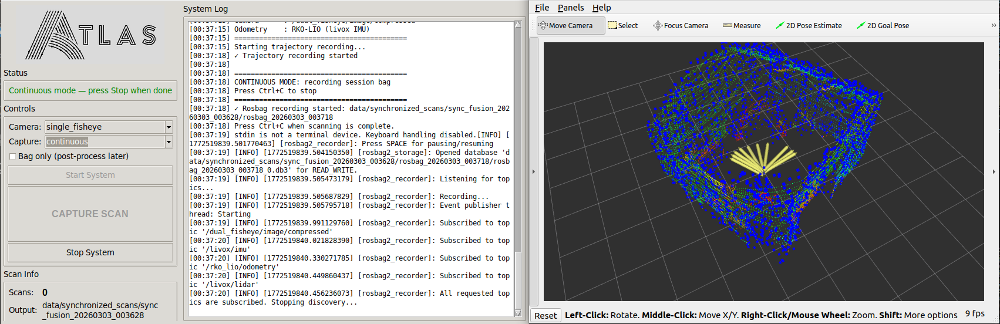

# Running the Software

## Configuration Settings

Before running the software, you can configure various options by editing the settings at the top of `~/atlas_ws/src/atlas-scanner/src/terrestrial_fusion_with_lio.sh`:

```bash
SAVE_E57=false                      # Set to true to enable E57 export
USE_EXISTING_CALIBRATION=false      # Set to true to skip calibration update from calib.json
ENABLE_ICP_ALIGNMENT=false          # Set to true to enable ICP alignment at end
BLEND_ERP_SEAMS=true                # Set to true to blend fisheye seams in ERP images before coloring
EXPORT_COLMAP=false                 # Set to true to export session to COLMAP format (experimental)
```

## Normal Operation

- Ensure the sensors are connected
  - Check with Livox first to confirm can connect to lidar config
      ```bash
      cd ~/atlas_ws &&
      source ~/atlas_ws/install/setup.bash &&
      ros2 launch livox_ros_driver2 rviz_MID360_launch.py
      ```
      `ctrl+c`

  - Bring up camera to test driver
      ```bash
      cd ~/atlas_ws &&
      source ~/atlas_ws/install/setup.bash

      sudo ~/atlas_ws/src/atlas-scanner/src/setup_camera_permissions.sh &&
      ros2 launch insta360_ros_driver bringup.launch.xml equirectangular:=true
      ```
      `ctrl+c`

- Run the software
  > *Note: Only terrestrial mode is currently supported, but SLAM will be available soon!*
  - Run headless
      ```bash
      ~/atlas_ws/src/atlas-scanner/src/run_headless.sh
      ```

  - Run with GUI
      ```bash
      ~/atlas_ws/src/atlas-scanner/src/run_gui.sh
      ```

- You can find the data for each scan session in `~/atlas_ws/data/synchronized_scans/sync_fusion_{TIMESTAMP}/`



## Advanced Operations
### Perform ICP on Scans
```bash
cd ~/atlas_ws && source install/setup.bash
python3 ~/atlas_ws/src/atlas-scanner/src/post_processing/align_scan_session.py ~/atlas_ws/data/synchronized_scans/sync_fusion_{TIMESTAMP}
```

### View Point Cloud in HTML Web Viewer
```bash
python3 ~/atlas_ws/src/atlas-scanner/src/post_processing/web_3d_viewer.py <PLY_FILE>

# Then launch the html file generated in your browser
```

### Generate Colmap Reconstruction (experimental)
```bash
SESSION=~/atlas_ws/data/synchronized_scans/sync_fusion_{TIMESTAMP}
rm -rf $SESSION/colmap
python3 ~/atlas_ws/src/atlas-scanner/src/post_processing/erp_to_perspective_colmap.py $SESSION
```
